#  🚀 Fusions

## <mark style="color:blue;">**Introduction**</mark>

Certains pokémons font l'objet d'une mécanique <mark style="color:blue;">**unique**</mark> et <mark style="color:blue;">**innovante**</mark> de Pokelegends. Celle-ci donne vie à des compagnons jamais vus auparavant grâce à un principe simple : **Les Fusions.**

## <mark style="color:blue;">**Qu'est-ce qu'une**</mark> <mark style="color:blue;"></mark><mark style="color:blue;">**fusion ?**</mark>

Le terrain sur lequel s'aventure les fusions est sans limite dû à son mode de fonctionnement : <mark style="color:red;">**Prenez deux pokémons**</mark>, <mark style="color:yellow;">**fusionnez-les**</mark> et.. <mark style="color:green;">**admirez le résultat**</mark> ! 👀

Ce qui fait des fusions que ce sont des pokémons si particuliers est sans doute leur polyvalence en bien des aspects. Peu importe la raison pour laquelle vous jouez à Pokelegends, les fusions viendront forcément compléter votre expérience de jeu actuelle en fonction de ce que vous recherchez !

## <mark style="color:blue;">**Pourquoi fusionner des pokémons ?**</mark>

* L'esthétique : Découvrez les <mark style="color:blue;">**sprites uniques**</mark> des fusions ! Chaque pokémon fusionné en possède deux : sa version classique et l'autre chromatique. Arriverez-vous à toutes les collectionner ?  👀 
* La <mark style="color:blue;">**stratégie Pokémon**</mark> : Les amateurs de combats pokémon ne seront pas déçus ! Par une fusion de deux pokémons, comptez sur le fait que leurs talents, leurs attaques, leurs types, leurs statistiques ainsi que toutes les autres caractéristiques propres aux pokémons seront également fusionnés !
* Le lore : Chaque pokémon a <mark style="color:blue;">**une histoire**</mark>, <mark style="color:blue;">**son histoire**</mark>.. En fusionnant deux pokémons, qui sait laquelle peut être ainsi créée !
* ...

## <mark style="color:blue;">**Comment obtenir des fusions ?**</mark>

* Via <mark style="color:blue;">**`/fusion`**</mark> en jeu : Une rotation de trois fusions est mise en place et vous sera proposée tous les lundis aux alentours de minuit. Le principe est le suivant : Sélectionnez la fusion qui vous intéresse, lisez sur l'interface ce qu'il vous sera demandé de faire (déposer un certain nombre de pokémons ou un certain nombre de méga gemmes) et dévérouillez-la par la suite ! Vous disposez d'un pourcentage de chance de <mark style="color:blue;">**10%**</mark> d'obtenir la version chromatique de la fusion complétée.

⚠️ **Aucun retour en arrière n'est possible : lorsque vous placez des pokémons dans le /fusion, faites attention d'en être bien certains !** ⚠️

* L'achat du grade fusion : En vous procurant ce grade (disponible via le <mark style="color:blue;">**`/grades`**</mark> en jeu), vous aurez la possibilité de prendre la fusion de votre choix grâce au <mark style="color:blue;">**ticket fusion**</mark> qui vous sera offert. Vous disposez du double de pourcentage de chance d'avoir un shiny par cette méthode (soit <mark style="color:blue;">**20%**</mark>).

🚀 **L'achat de ce grade, contrairement aux autres, n'est pas à usage unique. Vous avec donc la possibilité de vous l'octroyer autant de fois que vous le souhaitez.** 🚀

## <mark style="color:blue;">**Des fusions, des fusions.. Oui mais lesquelles ?**</mark>

🔎 **Actuellement sur le serveur, on en décompte 12 toutes plus fascinantes les une que les autres :** 🔎

| <mark style="color:blue;">**Image**</mark> | <mark style="color:blue;">**Fusion**</mark>     | <mark style="color:blue;">**Description**</mark> | <mark style="color:blue;">**HP**</mark>  | <mark style="color:blue;">**ATK**</mark> | <mark style="color:blue;">**DEF**</mark> | <mark style="color:blue;">**SPDEF**</mark> | <mark style="color:blue;">**SPATK**</mark> | <mark style="color:blue;">**SPD**</mark> |
|:-----:|:------:|:------------:|:--:|:--:|:--:|:----:|:----:|:--:|
| <figure>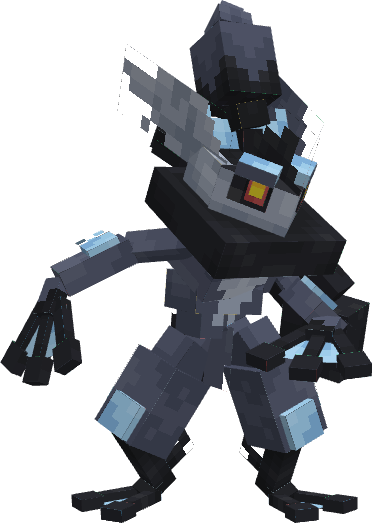</figure>                      |  <mark style="color:blue;">**Amphi**</mark><mark style="color:darkblue;">**shadow**</mark>        |  Amphinobi et Marshadow, de type Eau/Spectre           | 90   | 125   | 80   | 103    | 90    | 125   |
| <figure>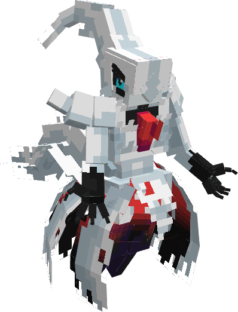</figure>      | <mark style="color:black;">**Dar**</mark><mark style="color:pink;">**devoir**</mark>           | Darkrai et Gardevoir, de type Ténèbres/Psy            | 70    | 90    | 90    | 135      | 115      | 125    |
| <figure>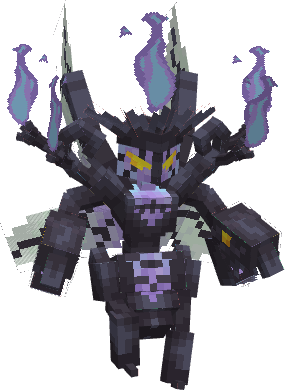</figure>      | <mark style="color:green;">**Ciza**</mark><mark style="color:red;">**labre**</mark>           | Cizayox et Lugulabre, de type Insecte/Feu            | 70    | 130    | 100    | 145      | 90      | 80    |
| <figure>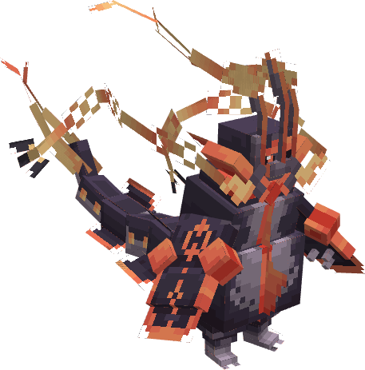</figure>      | <mark style="color:darkblue;">**Mega Ray**</mark><mark style="color:gray;">**goleon**</mark>           | Cizayox et Lugulabre, de type Insecte/Feu            | 105    | 180    | 100    | 180      | 100      | 115    |
| <figure>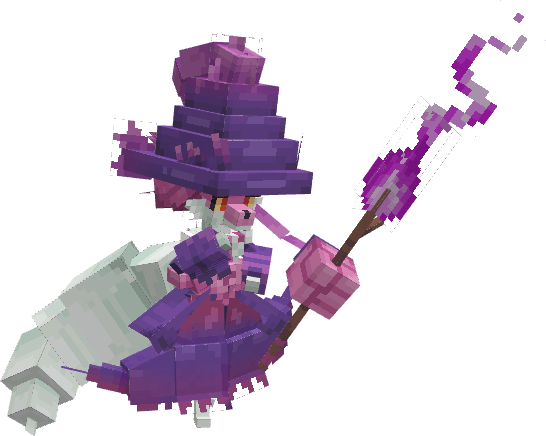</figure>      | <mark style="color:red;">**Magi**</mark><mark style="color:purple;">**pelin**</mark>           | Magirêve et Goupelin, de type Feu/Spectre            | 75    | 69    | 72    | 114      | 105      | 105    |
| <figure>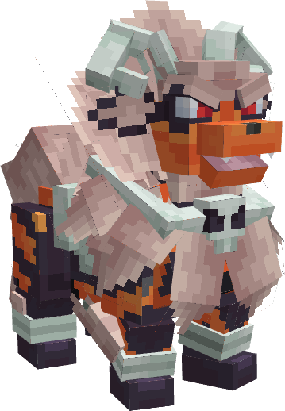</figure>      | <mark style="color:red;">**Arca**</mark><mark style="color:black;">**losse**</mark>           | Arcanin et Démolosse, de type Feu/Ténèbres            | 90    | 110    | 80    | 110      | 80      | 95    |
| <figure>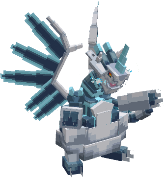</figure>      | <mark style="color:gray;">**Mega Gale**</mark><mark style="color:darkblue;">**feu X**</mark>           | Mega Galeking et Mega Dracaufeu X, de type Acier/Dragon             | 78    | 140    | 230    | 130      | 85      | 100    |
| <figure>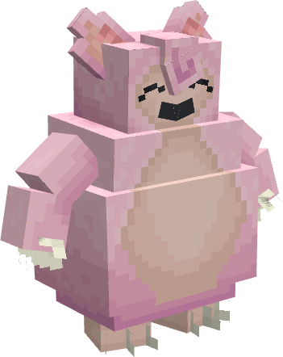</figure>      | <mark style="color:white;">**Rondou**</mark><mark style="color:pink;">**flex**</mark>           | Rondoudou et Ronflex, de type Normal/Fée            | 160    | 110    | 65    | 65      | 110    | 30    |
| <figure></figure>      | <mark style="color:green;">**Rexi**</mark><mark style="color:darkblue;">**zarre**</mark>           | Rexillius et Florizarre, de type Plante/Dragon            | 82  | 121  | 119  | 100   | 100   | 80   |
| <figure>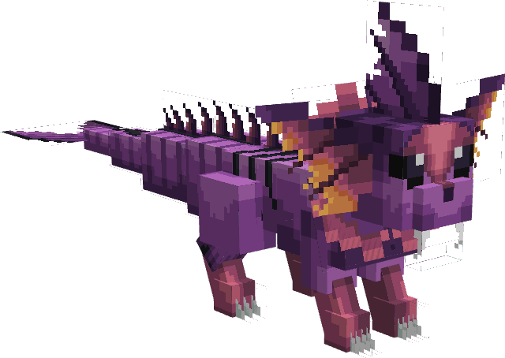</figure>      | <mark style="color:purple;">**Ar**</mark><mark style="color:blue;">**quali**</mark>           | Arbok et Aquali, de type Poison/Eau            | 130 |   95    | 69   | 110   | 95    | 80    |
| <figure>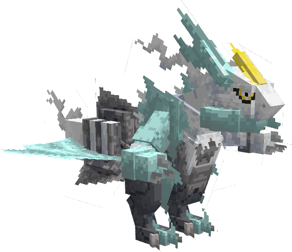</figure>      | <mark style="color:darkblue;">**Kyurem**</mark><mark style="color:skyblue;">**Blanc**</mark>           | Kyurem et Zekrom, de type Dragon/Glace            | 125   | 120   | 90    | 170   | 100   | 95   |
| <figure>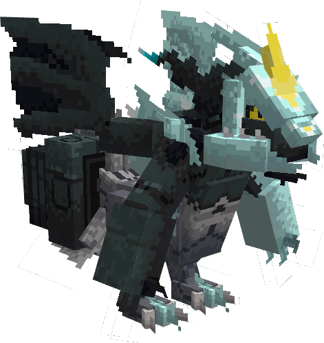</figure> | <mark style="color:darkblue;">**Kyurem**</mark><mark style="color:skyblue;">**Noir**</mark>  | Kyurem et Reshiram, de type Dragon/Glace | 125 | 170 | 100 | 120 | 90 | 95 |

***
